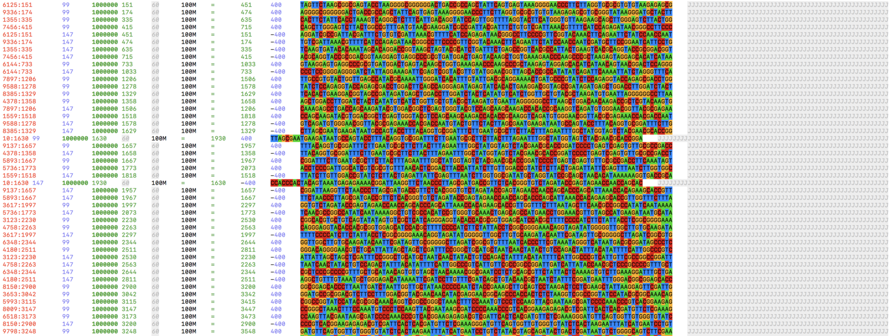

Table of Contents
=================

* [Learning the BAM format](#learning-the-bam-format)
* [Introduction](#introduction)
* [Installing SAMtools](#installing-samtools)
* [Basic usage](#basic-usage)
* [Viewing](#viewing)
* [Converting a SAM file to a BAM file](#converting-a-sam-file-to-a-bam-file)
* [Converting a BAM file to a CRAM file](#converting-a-bam-file-to-a-cram-file)
* [Sorting a SAM/BAM file](#sorting-a-sambam-file)
* [Creating a BAM index file](#creating-a-bam-index-file)
* [Interpreting the BAM flags](#interpreting-the-bam-flags)
* [Filtering unmapped reads](#filtering-unmapped-reads)
* [Extracting entries mapping to a specific loci](#extracting-entries-mapping-to-a-specific-loci)
* [Extracting only the first read from paired end BAM files](#extracting-only-the-first-read-from-paired-end-bam-files)
* [Stats](#stats)
* [samtools calmd/fillmd](#samtools-calmdfillmd)
* [Creating FASTQ files from a BAM file](#creating-fastq-files-from-a-bam-file)
* [Random subsampling of BAM file](#random-subsampling-of-bam-file)
* [Count number of reads](#count-number-of-reads)
* [Obtaining genomic sequence](#obtaining-genomic-sequence)
* [Comparing BAM files](#comparing-bam-files)
* [Converting reference names](#converting-reference-names)
* [Coverage](#coverage)
* [Stargazers over time](#stargazers-over-time)

Created by [gh-md-toc](https://github.com/ekalinin/github-markdown-toc)

Wed Jul 21 11:44:40 JST 2021

Learning the BAM format
================

# Introduction

SAMtools provides various (sub)tools for manipulating alignments in the
SAM/BAM format. The SAM (Sequence Alignment/Map) format (BAM is just the
binary form of SAM) is currently the *de facto* standard for storing
large nucleotide sequence alignments. If you are working with
high-throughput sequencing data, at some point you will probably have to
deal with SAM/BAM files, so familiarise yourself with them! For the
latest information on SAMtools, please refer to the [release
notes](https://github.com/samtools/samtools/releases).

The examples in this README use the `ERR188273_chrX.bam` BAM file
(stored in the `eg` folder) generated as per
<https://github.com/davetang/rnaseq> using the HISAT2 + StringTie2
RNA-seq pipeline. This README is generated using the `create_readme.sh`
script; if you want to generate this file yourself, you can try using
the `Makefile` by running `make` on a Linux-based operating system. (If
you have Conda installed, please run `conda deactivate` first before
`make` and if you are using macOS, please refer to the `README.md` in
`etc`.) This will download the required reference file, compile
`samtools` (version 1.13), set up `Miniconda3`, `R`, install the
`Rmarkdown` package, and finally generate this README. It will take some
time to perform all these steps (and will probably break if you are
missing some dependency).

# Installing SAMtools

For installing SAMtools, I recommend using `Conda` and the [Bioconda
samtools package](https://anaconda.org/bioconda/samtools). I also
recommend using
[Miniconda](https://docs.conda.io/en/latest/miniconda.html) instead of
Anaconda because Anaconda comes with a lot of tools/packages that you
will probably not use. I wrote a [short introduction to
Conda](https://davetang.github.io/reproducible_bioinformatics/conda.html)
if you want to find learn more.

Once you have installed Miniconda, you can install SAMtools as follows:

``` bash
conda install -c bioconda samtools
```

# Basic usage

If you run `samtools` on the terminal without any parameters or with
`--help`, all the available utilities are listed:

``` bash
samtools --help
```

    ## 
    ## Program: samtools (Tools for alignments in the SAM format)
    ## Version: 1.13 (using htslib 1.13)
    ## 
    ## Usage:   samtools <command> [options]
    ## 
    ## Commands:
    ##   -- Indexing
    ##      dict           create a sequence dictionary file
    ##      faidx          index/extract FASTA
    ##      fqidx          index/extract FASTQ
    ##      index          index alignment
    ## 
    ##   -- Editing
    ##      calmd          recalculate MD/NM tags and '=' bases
    ##      fixmate        fix mate information
    ##      reheader       replace BAM header
    ##      targetcut      cut fosmid regions (for fosmid pool only)
    ##      addreplacerg   adds or replaces RG tags
    ##      markdup        mark duplicates
    ##      ampliconclip   clip oligos from the end of reads
    ## 
    ##   -- File operations
    ##      collate        shuffle and group alignments by name
    ##      cat            concatenate BAMs
    ##      merge          merge sorted alignments
    ##      mpileup        multi-way pileup
    ##      sort           sort alignment file
    ##      split          splits a file by read group
    ##      quickcheck     quickly check if SAM/BAM/CRAM file appears intact
    ##      fastq          converts a BAM to a FASTQ
    ##      fasta          converts a BAM to a FASTA
    ##      import         Converts FASTA or FASTQ files to SAM/BAM/CRAM
    ## 
    ##   -- Statistics
    ##      bedcov         read depth per BED region
    ##      coverage       alignment depth and percent coverage
    ##      depth          compute the depth
    ##      flagstat       simple stats
    ##      idxstats       BAM index stats
    ##      phase          phase heterozygotes
    ##      stats          generate stats (former bamcheck)
    ##      ampliconstats  generate amplicon specific stats
    ## 
    ##   -- Viewing
    ##      flags          explain BAM flags
    ##      tview          text alignment viewer
    ##      view           SAM<->BAM<->CRAM conversion
    ##      depad          convert padded BAM to unpadded BAM
    ## 
    ##   -- Misc
    ##      help [cmd]     display this help message or help for [cmd]
    ##      version        detailed version information

# Viewing

Use [bioSyntax](https://github.com/bioSyntax/bioSyntax) to prettify your
output.

``` bash
samtools view aln.bam | sam-less
```



# Converting a SAM file to a BAM file

A BAM file is just a SAM file but stored in binary format; you should
always convert your SAM files into BAM format since they are smaller in
size and are faster to manipulate.

I don’t have a SAM file in the example folder, so let’s create one and
check out the first ten lines. Note: remember to use `-h` to ensure the
SAM file contains the sequence header information. Generally, I
recommend storing only sorted BAM files as they use even less disk space
and are faster to process.

``` bash
samtools view -h eg/ERR188273_chrX.bam > eg/ERR188273_chrX.sam
```

Notice that the SAM file is much larger than the BAM file.

Size of SAM file.

``` bash
ls -lh eg/ERR188273_chrX.sam
```

    ## -rw-r--r-- 1 dtang dtang 321M Jul 21 11:42 eg/ERR188273_chrX.sam

Size of BAM file.

``` bash
ls -lh eg/ERR188273_chrX.bam
```

    ## -rw-r--r-- 1 dtang dtang 67M Jul 15 13:55 eg/ERR188273_chrX.bam

We can use `head` to view a SAM file.

``` bash
head eg/ERR188273_chrX.sam
```

    ## @HD  VN:1.0  SO:coordinate
    ## @SQ  SN:chrX LN:156040895
    ## @PG  ID:hisat2   PN:hisat2   VN:2.2.0    CL:"/Users/dtang/github/rnaseq/hisat2/../src/hisat2-2.2.0/hisat2-align-s --wrapper basic-0 --dta -p 4 -x ../raw/chrX_data/indexes/chrX_tran -1 /tmp/4195.inpipe1 -2 /tmp/4195.inpipe2"
    ## @PG  ID:samtools PN:samtools PP:hisat2   VN:1.13 CL:samtools view -h eg/ERR188273_chrX.bam
    ## ERR188273.4711308    73  chrX    21649   0   5S70M   =   21649   0   CGGGTGATCACGAGGTCAGGAGATCAAGACCATCCTGGCCAACACAGTGAAACCCCATCTCTACTAAAAATACAA @@@F=DDFFHGHBHIFFHIGGIFGEGHFHIGIGIFIIIGIGIGGDHIIGIIC@>DGHCHHHGHHFFFFFDEACC@ AS:i:-5 ZS:i:-5 XN:i:0  XM:i:0  XO:i:0  XG:i:0  NM:i:0  MD:Z:70 YT:Z:UP NH:i:2
    ## ERR188273.4711308    133 chrX    21649   0   *   =   21649   0   CTACAGGTGCCCGCCACCATGCCCAGCTAATTTTTTTTGTATTTTTAGTAGAGATGGGGTTTCACTGTGTTGGCC CB@FDFFFHHGFHIJJJJIIIIIIIGGGIJGIIJJJJJJFFHIIIIGECHEHHGGHHFF?AACCDDDDDDDDBCD YT:Z:UP
    ## ERR188273.4711308    329 chrX    233717  0   5S70M   =   233717  0   CGGGTGATCACGAGGTCAGGAGATCAAGACCATCCTGGCCAACACAGTGAAACCCCATCTCTACTAAAAATACAA @@@F=DDFFHGHBHIFFHIGGIFGEGHFHIGIGIFIIIGIGIGGDHIIGIIC@>DGHCHHHGHHFFFFFDEACC@ AS:i:-5 ZS:i:-5 XN:i:0  XM:i:0  XO:i:0  XG:i:0  NM:i:0  MD:Z:70 YT:Z:UP NH:i:2
    ## ERR188273.14904746   99  chrX    251271  60  75M =   251317  121 GAAAAATGGGCCCAGGGGACCGGCGCTCAGCATACAGAGGACCCGCGCCGGCACCTGCCTCTGAGTTCCCTTAGT @@<DDDDDFB>HHEGIIGAGIIIBGIIG@FECH<F@GIIFAE=?BCBBCBBB5@<?CBBCCCCAACDCCCCCCCC AS:i:0  XN:i:0  XM:i:0  XO:i:0  XG:i:0  NM:i:0  MD:Z:75 YS:i:-2 YT:Z:CP NH:i:1
    ## ERR188273.14904746   147 chrX    251317  60  75M =   251271  -121    GCCGGCCCCTGCCTCTGAGTTCCCTTAGTACTTATTGATCATTATCGGGGAGAGGGGGATGTGGCAGGACAATAG #######B?DAHC@EGIIGGEHHGC@GFBFCEGFCIGG@EG@@H<JIEHEF@IGEHGHIIHFGHDDFDDDDD?<B AS:i:-2 ZS:i:-7 XN:i:0  XM:i:1  XO:i:0  XG:i:0  NM:i:1  MD:Z:6A68   YS:i:0  YT:Z:CP NH:i:1
    ## ERR188273.5849805    163 chrX    265951  1   75M =   266022  146 CGGGTTCACGCCATTCTCCTGCCTCAGCCTCCCGAGTAGCTGGGACTACAGGCGCCCGCCACCACGCCCGGCTAA @CCFDFFFHHHHHJJJJJJFJJJJJIJIJJJJJJJJGHIJJJJJEHIJIJGIIJJJHHFFDDEDDDDDDDDDDDD AS:i:0  ZS:i:0  XN:i:0  XM:i:0  XO:i:0  XG:i:0  NM:i:0  MD:Z:75 YS:i:0  YT:Z:CP NH:i:2

The lines starting with an “@” symbol contains the header information.
The @SQ tag is the reference sequence dictionary; SN refers to the
reference sequence name and LN refers to the reference sequence length.
If you don’t see lines starting with the “@” symbol, the header
information is probably missing. You can generate this information again
by running the command below, where `ref.fa` is the reference FASTA file
used to map the reads.

``` bash
samtools view -bT sequence/ref.fa aln.sam > aln.bam
```

If the header information is available, we can convert a SAM file into
BAM by using `samtools view -b`. In newer versions of SAMtools, the
input format is auto-detected, so we no longer need the `-S` parameter.

``` bash
samtools view -b eg/ERR188273_chrX.sam > eg/my.bam
```

# Converting a BAM file to a CRAM file

The CRAM format is even more compact. Use `samtools view` with the `-T`
and `-C` arguments to convert a BAM file into CRAM.

``` bash
samtools view -T genome/chrX.fa -C -o eg/ERR188273_chrX.cram eg/ERR188273_chrX.bam

ls -lh eg/ERR188273_chrX.[sbcr]*am
```

    ## -rw-r--r-- 1 dtang dtang  67M Jul 15 13:55 eg/ERR188273_chrX.bam
    ## -rw-r--r-- 1 dtang dtang  40M Jul 21 11:42 eg/ERR188273_chrX.cram
    ## -rw-r--r-- 1 dtang dtang 321M Jul 21 11:42 eg/ERR188273_chrX.sam

You can use `samtools view` to view a CRAM file just as you would for a
BAM file.

``` bash
samtools view eg/ERR188273_chrX.cram | head
```

    ## ERR188273.4711308    73  chrX    21649   0   5S70M   =   21649   0   CGGGTGATCACGAGGTCAGGAGATCAAGACCATCCTGGCCAACACAGTGAAACCCCATCTCTACTAAAAATACAA @@@F=DDFFHGHBHIFFHIGGIFGEGHFHIGIGIFIIIGIGIGGDHIIGIIC@>DGHCHHHGHHFFFFFDEACC@ AS:i:-5 ZS:i:-5 XN:i:0  XM:i:0  XO:i:0  XG:i:0  YT:Z:UP NH:i:2  MD:Z:70 NM:i:0
    ## ERR188273.4711308    133 chrX    21649   0   *   =   21649   0   CTACAGGTGCCCGCCACCATGCCCAGCTAATTTTTTTTGTATTTTTAGTAGAGATGGGGTTTCACTGTGTTGGCC CB@FDFFFHHGFHIJJJJIIIIIIIGGGIJGIIJJJJJJFFHIIIIGECHEHHGGHHFF?AACCDDDDDDDDBCD YT:Z:UP
    ## ERR188273.4711308    329 chrX    233717  0   5S70M   =   233717  0   CGGGTGATCACGAGGTCAGGAGATCAAGACCATCCTGGCCAACACAGTGAAACCCCATCTCTACTAAAAATACAA @@@F=DDFFHGHBHIFFHIGGIFGEGHFHIGIGIFIIIGIGIGGDHIIGIIC@>DGHCHHHGHHFFFFFDEACC@ AS:i:-5 ZS:i:-5 XN:i:0  XM:i:0  XO:i:0  XG:i:0  YT:Z:UP NH:i:2  MD:Z:70 NM:i:0
    ## ERR188273.14904746   99  chrX    251271  60  75M =   251317  121 GAAAAATGGGCCCAGGGGACCGGCGCTCAGCATACAGAGGACCCGCGCCGGCACCTGCCTCTGAGTTCCCTTAGT @@<DDDDDFB>HHEGIIGAGIIIBGIIG@FECH<F@GIIFAE=?BCBBCBBB5@<?CBBCCCCAACDCCCCCCCC AS:i:0  XN:i:0  XM:i:0  XO:i:0  XG:i:0  YS:i:-2 YT:Z:CP NH:i:1  MD:Z:75 NM:i:0
    ## ERR188273.14904746   147 chrX    251317  60  75M =   251271  -121    GCCGGCCCCTGCCTCTGAGTTCCCTTAGTACTTATTGATCATTATCGGGGAGAGGGGGATGTGGCAGGACAATAG #######B?DAHC@EGIIGGEHHGC@GFBFCEGFCIGG@EG@@H<JIEHEF@IGEHGHIIHFGHDDFDDDDD?<B AS:i:-2 ZS:i:-7 XN:i:0  XM:i:1  XO:i:0  XG:i:0  YS:i:0  YT:Z:CP NH:i:1  MD:Z:6A68   NM:i:1
    ## ERR188273.5849805    163 chrX    265951  1   75M =   266022  146 CGGGTTCACGCCATTCTCCTGCCTCAGCCTCCCGAGTAGCTGGGACTACAGGCGCCCGCCACCACGCCCGGCTAA @CCFDFFFHHHHHJJJJJJFJJJJJIJIJJJJJJJJGHIJJJJJEHIJIJGIIJJJHHFFDDEDDDDDDDDDDDD AS:i:0  ZS:i:0  XN:i:0  XM:i:0  XO:i:0  XG:i:0  YS:i:0  YT:Z:CP NH:i:2  MD:Z:75 NM:i:0
    ## ERR188273.1232356    369 chrX    265984  1   75M =   118343251   0   GAGTAGCTGGGACTACAGGCGCCCGCCACCACGCCCGGCTAATTTTTTGTATTTTTAGTAGAGACGGGGTTTCAC @@CA@B>DC>>+@::8-755-BBBFDDEHHBGGEGHEEIJIIGIJJIGEIIIJJJIIJJIGGHHHGGFFFFF@@C AS:i:0  ZS:i:0  XN:i:0  XM:i:0  XO:i:0  XG:i:0  YT:Z:UP NH:i:10 MD:Z:75 NM:i:0
    ## ERR188273.5927795    385 chrX    265991  1   75M =   114048277   0   TGGGACTACAGGCGCCCGCCACCACGCCCGGCTAATTTTTTGTATTTTTAGTAGAGACGGGGTTTCACCGTGTTA =?BB??BD?FBHHBEAE@CDGG@HH=FA@GEGE;FGACCHBE6?A=ACE9)7@DCE>>5'3=338:;:>2<AA?: AS:i:0  ZS:i:0  XN:i:0  XM:i:0  XO:i:0  XG:i:0  YT:Z:UP NH:i:10 MD:Z:75 NM:i:0
    ## ERR188273.5849805    83  chrX    266022  1   75M =   265951  -146    CTAATTTTTTGTATTTTTAGTAGAGACGGGGTTTCACCGTGTTAGCCAGGATGGTGTCGATCTCCTGACCTCGTG DDDDDDDEEEEEDBFEDGHHHHHHJHIJJIGIGHFBJJIHGJJIIJJJJJJJJIGIJJJJJJHHHHHDFFFFCCB AS:i:0  ZS:i:0  XN:i:0  XM:i:0  XO:i:0  XG:i:0  YS:i:0  YT:Z:CP NH:i:2  MD:Z:75 NM:i:0
    ## ERR188273.13655123   113 chrX    266022  1   75M =   118343234   0   CTAATTTTTTGTATTTTTAGTAGAGACGGGGTTTCACCGTGTTAGCCAGGATGGTGTCGATCTCCTGACCTCGTG AACBBBACCCC>;3?BCFFEEHHHEEGIGGHAGFBBHFBHHEHCG@<@ABG??@@?BB9GBGAFFD<<DDAD@@@ AS:i:0  ZS:i:0  XN:i:0  XM:i:0  XO:i:0  XG:i:0  YT:Z:UP NH:i:2  MD:Z:75 NM:i:0

I have an [old blog
post](https://davetang.org/muse/2014/09/26/bam-to-cram/) on the CRAM
format.

# Sorting a SAM/BAM file

Many downstream tools require sorted BAM files and since they are
slightly more compact than unsorted BAM files, you should always sorted
BAM files. In SAMtools version 1.3 or newer, you can directly generate a
sorted BAM file from a SAM file.

``` bash
samtools sort eg/ERR188273_chrX.sam -o eg/sorted.bam
ls -l eg/ERR188273_chrX.bam
ls -l eg/sorted.bam
```

    ## -rw-r--r-- 1 dtang dtang 69983526 Jul 15 13:55 eg/ERR188273_chrX.bam
    ## -rw-r--r-- 1 dtang dtang 69983598 Jul 21 11:42 eg/sorted.bam

You should use use additional threads (if they are available) to speed
up sorting; to use four threads, use `-@ 4`.

Time taken using one thread (default).

``` bash
time samtools sort eg/ERR188273_chrX.sam -o eg/sorted.bam
```

    ## 
    ## real 0m17.879s
    ## user 0m8.395s
    ## sys  0m0.679s

Time taken using four threads.

``` bash
time samtools sort -@ 4 eg/ERR188273_chrX.sam -o eg/sorted.bam
```

    ## [bam_sort_core] merging from 0 files and 4 in-memory blocks...
    ## 
    ## real 0m4.373s
    ## user 0m9.085s
    ## sys  0m0.390s

Many of the SAMtools subtools can use additional threads, so make use of
them if you have the resources!

# Creating a BAM index file

Various tools require BAM index files, such as IGV, which is a tool that
can be used for visualising BAM files.

``` bash
samtools index eg/ERR188273_chrX.bam
```

# Interpreting the BAM flags

The second column in a SAM/BAM file is the flag column; use the `flags`
subcommand to understand specific flags. They may seem confusing at
first but the encoding allows details about a read to be stored by just
using a few digits. The trick is to convert the numerical digit into
binary, and then use the table to interpret the binary numbers, where 1
= true and 0 = false. I wrote a blog post on BAM flags at
<http://davetang.org/muse/2014/03/06/understanding-bam-flags/>.

``` bash
samtools flags
```

    ## About: Convert between textual and numeric flag representation
    ## Usage: samtools flags FLAGS...
    ## 
    ## Each FLAGS argument is either an INT (in decimal/hexadecimal/octal) representing
    ## a combination of the following numeric flag values, or a comma-separated string
    ## NAME,...,NAME representing a combination of the following flag names:
    ## 
    ##    0x1     1  PAIRED         paired-end / multiple-segment sequencing technology
    ##    0x2     2  PROPER_PAIR    each segment properly aligned according to aligner
    ##    0x4     4  UNMAP          segment unmapped
    ##    0x8     8  MUNMAP         next segment in the template unmapped
    ##   0x10    16  REVERSE        SEQ is reverse complemented
    ##   0x20    32  MREVERSE       SEQ of next segment in template is rev.complemented
    ##   0x40    64  READ1          the first segment in the template
    ##   0x80   128  READ2          the last segment in the template
    ##  0x100   256  SECONDARY      secondary alignment
    ##  0x200   512  QCFAIL         not passing quality controls or other filters
    ##  0x400  1024  DUP            PCR or optical duplicate
    ##  0x800  2048  SUPPLEMENTARY  supplementary alignment

# Filtering unmapped reads

Use `-F 4` to filter out unmapped reads.

``` bash
samtools view -F 4 -b eg/ERR188273_chrX.bam > eg/ERR188273_chrX.mapped.bam
```

Use `-f 4` to keep only unmapped reads.

``` bash
samtools view -f 4 -b eg/ERR188273_chrX.bam > eg/ERR188273_chrX.unmapped.bam
```

We can use the `flags` subcommand to confirm that a value of four
represents an unmapped read.

``` bash
samtools flags 4
```

    ## 0x4  4   UNMAP

# Extracting entries mapping to a specific loci

Use `samtools view` and the `ref:start-end` syntax to extract reads
mapping within a specific genomic loci; this requires a BAM index file.

``` bash
samtools view eg/ERR188273_chrX.bam chrX:20000-30000
```

    ## ERR188273.4711308    73  chrX    21649   0   5S70M   =   21649   0   CGGGTGATCACGAGGTCAGGAGATCAAGACCATCCTGGCCAACACAGTGAAACCCCATCTCTACTAAAAATACAA @@@F=DDFFHGHBHIFFHIGGIFGEGHFHIGIGIFIIIGIGIGGDHIIGIIC@>DGHCHHHGHHFFFFFDEACC@ AS:i:-5 ZS:i:-5 XN:i:0  XM:i:0  XO:i:0  XG:i:0  NM:i:0  MD:Z:70 YT:Z:UP NH:i:2
    ## ERR188273.4711308    133 chrX    21649   0   *   =   21649   0   CTACAGGTGCCCGCCACCATGCCCAGCTAATTTTTTTTGTATTTTTAGTAGAGATGGGGTTTCACTGTGTTGGCC CB@FDFFFHHGFHIJJJJIIIIIIIGGGIJGIIJJJJJJFFHIIIIGECHEHHGGHHFF?AACCDDDDDDDDBCD YT:Z:UP

Note that this takes into account the mapping of the entire read and not
just the starting position. For example, if you specified
chrX:20000-30000, a 75 bp long read that starts its mapping from
position 19999 will also be returned. In addition, you can save the
output as another BAM file if you want.

``` bash
samtools view -b eg/ERR188273_chrX.bam chrX:20000-30000 > eg/ERR188273_chrX_20000_30000.bam
```

If you want reads mapped to a single reference (e.g. chromosome), just
specify the `ref` and leave out the start and end values.

``` bash
samtools view eg/ERR188273_chrX.bam chrX | head
```

    ## ERR188273.4711308    73  chrX    21649   0   5S70M   =   21649   0   CGGGTGATCACGAGGTCAGGAGATCAAGACCATCCTGGCCAACACAGTGAAACCCCATCTCTACTAAAAATACAA @@@F=DDFFHGHBHIFFHIGGIFGEGHFHIGIGIFIIIGIGIGGDHIIGIIC@>DGHCHHHGHHFFFFFDEACC@ AS:i:-5 ZS:i:-5 XN:i:0  XM:i:0  XO:i:0  XG:i:0  NM:i:0  MD:Z:70 YT:Z:UP NH:i:2
    ## ERR188273.4711308    133 chrX    21649   0   *   =   21649   0   CTACAGGTGCCCGCCACCATGCCCAGCTAATTTTTTTTGTATTTTTAGTAGAGATGGGGTTTCACTGTGTTGGCC CB@FDFFFHHGFHIJJJJIIIIIIIGGGIJGIIJJJJJJFFHIIIIGECHEHHGGHHFF?AACCDDDDDDDDBCD YT:Z:UP
    ## ERR188273.4711308    329 chrX    233717  0   5S70M   =   233717  0   CGGGTGATCACGAGGTCAGGAGATCAAGACCATCCTGGCCAACACAGTGAAACCCCATCTCTACTAAAAATACAA @@@F=DDFFHGHBHIFFHIGGIFGEGHFHIGIGIFIIIGIGIGGDHIIGIIC@>DGHCHHHGHHFFFFFDEACC@ AS:i:-5 ZS:i:-5 XN:i:0  XM:i:0  XO:i:0  XG:i:0  NM:i:0  MD:Z:70 YT:Z:UP NH:i:2
    ## ERR188273.14904746   99  chrX    251271  60  75M =   251317  121 GAAAAATGGGCCCAGGGGACCGGCGCTCAGCATACAGAGGACCCGCGCCGGCACCTGCCTCTGAGTTCCCTTAGT @@<DDDDDFB>HHEGIIGAGIIIBGIIG@FECH<F@GIIFAE=?BCBBCBBB5@<?CBBCCCCAACDCCCCCCCC AS:i:0  XN:i:0  XM:i:0  XO:i:0  XG:i:0  NM:i:0  MD:Z:75 YS:i:-2 YT:Z:CP NH:i:1
    ## ERR188273.14904746   147 chrX    251317  60  75M =   251271  -121    GCCGGCCCCTGCCTCTGAGTTCCCTTAGTACTTATTGATCATTATCGGGGAGAGGGGGATGTGGCAGGACAATAG #######B?DAHC@EGIIGGEHHGC@GFBFCEGFCIGG@EG@@H<JIEHEF@IGEHGHIIHFGHDDFDDDDD?<B AS:i:-2 ZS:i:-7 XN:i:0  XM:i:1  XO:i:0  XG:i:0  NM:i:1  MD:Z:6A68   YS:i:0  YT:Z:CP NH:i:1
    ## ERR188273.5849805    163 chrX    265951  1   75M =   266022  146 CGGGTTCACGCCATTCTCCTGCCTCAGCCTCCCGAGTAGCTGGGACTACAGGCGCCCGCCACCACGCCCGGCTAA @CCFDFFFHHHHHJJJJJJFJJJJJIJIJJJJJJJJGHIJJJJJEHIJIJGIIJJJHHFFDDEDDDDDDDDDDDD AS:i:0  ZS:i:0  XN:i:0  XM:i:0  XO:i:0  XG:i:0  NM:i:0  MD:Z:75 YS:i:0  YT:Z:CP NH:i:2
    ## ERR188273.1232356    369 chrX    265984  1   75M =   118343251   0   GAGTAGCTGGGACTACAGGCGCCCGCCACCACGCCCGGCTAATTTTTTGTATTTTTAGTAGAGACGGGGTTTCAC @@CA@B>DC>>+@::8-755-BBBFDDEHHBGGEGHEEIJIIGIJJIGEIIIJJJIIJJIGGHHHGGFFFFF@@C AS:i:0  ZS:i:0  XN:i:0  XM:i:0  XO:i:0  XG:i:0  NM:i:0  MD:Z:75 YT:Z:UP NH:i:10
    ## ERR188273.5927795    385 chrX    265991  1   75M =   114048277   0   TGGGACTACAGGCGCCCGCCACCACGCCCGGCTAATTTTTTGTATTTTTAGTAGAGACGGGGTTTCACCGTGTTA =?BB??BD?FBHHBEAE@CDGG@HH=FA@GEGE;FGACCHBE6?A=ACE9)7@DCE>>5'3=338:;:>2<AA?: AS:i:0  ZS:i:0  XN:i:0  XM:i:0  XO:i:0  XG:i:0  NM:i:0  MD:Z:75 YT:Z:UP NH:i:10
    ## ERR188273.5849805    83  chrX    266022  1   75M =   265951  -146    CTAATTTTTTGTATTTTTAGTAGAGACGGGGTTTCACCGTGTTAGCCAGGATGGTGTCGATCTCCTGACCTCGTG DDDDDDDEEEEEDBFEDGHHHHHHJHIJJIGIGHFBJJIHGJJIIJJJJJJJJIGIJJJJJJHHHHHDFFFFCCB AS:i:0  ZS:i:0  XN:i:0  XM:i:0  XO:i:0  XG:i:0  NM:i:0  MD:Z:75 YS:i:0  YT:Z:CP NH:i:2
    ## ERR188273.13655123   113 chrX    266022  1   75M =   118343234   0   CTAATTTTTTGTATTTTTAGTAGAGACGGGGTTTCACCGTGTTAGCCAGGATGGTGTCGATCTCCTGACCTCGTG AACBBBACCCC>;3?BCFFEEHHHEEGIGGHAGFBBHFBHHEHCG@<@ABG??@@?BB9GBGAFFD<<DDAD@@@ AS:i:0  ZS:i:0  XN:i:0  XM:i:0  XO:i:0  XG:i:0  NM:i:0  MD:Z:75 YT:Z:UP NH:i:2

You can also use a BED file, with several entries, to extract reads of
interest.

``` bash
cat eg/my.bed 

samtools view -L eg/my.bed eg/ERR188273_chrX.bam
```

    ## chrX 20000   30000
    ## chrX 233000  260000
    ## ERR188273.4711308    73  chrX    21649   0   5S70M   =   21649   0   CGGGTGATCACGAGGTCAGGAGATCAAGACCATCCTGGCCAACACAGTGAAACCCCATCTCTACTAAAAATACAA @@@F=DDFFHGHBHIFFHIGGIFGEGHFHIGIGIFIIIGIGIGGDHIIGIIC@>DGHCHHHGHHFFFFFDEACC@ AS:i:-5 ZS:i:-5 XN:i:0  XM:i:0  XO:i:0  XG:i:0  NM:i:0  MD:Z:70 YT:Z:UP NH:i:2
    ## ERR188273.4711308    133 chrX    21649   0   *   =   21649   0   CTACAGGTGCCCGCCACCATGCCCAGCTAATTTTTTTTGTATTTTTAGTAGAGATGGGGTTTCACTGTGTTGGCC CB@FDFFFHHGFHIJJJJIIIIIIIGGGIJGIIJJJJJJFFHIIIIGECHEHHGGHHFF?AACCDDDDDDDDBCD YT:Z:UP
    ## ERR188273.4711308    329 chrX    233717  0   5S70M   =   233717  0   CGGGTGATCACGAGGTCAGGAGATCAAGACCATCCTGGCCAACACAGTGAAACCCCATCTCTACTAAAAATACAA @@@F=DDFFHGHBHIFFHIGGIFGEGHFHIGIGIFIIIGIGIGGDHIIGIIC@>DGHCHHHGHHFFFFFDEACC@ AS:i:-5 ZS:i:-5 XN:i:0  XM:i:0  XO:i:0  XG:i:0  NM:i:0  MD:Z:70 YT:Z:UP NH:i:2
    ## ERR188273.14904746   99  chrX    251271  60  75M =   251317  121 GAAAAATGGGCCCAGGGGACCGGCGCTCAGCATACAGAGGACCCGCGCCGGCACCTGCCTCTGAGTTCCCTTAGT @@<DDDDDFB>HHEGIIGAGIIIBGIIG@FECH<F@GIIFAE=?BCBBCBBB5@<?CBBCCCCAACDCCCCCCCC AS:i:0  XN:i:0  XM:i:0  XO:i:0  XG:i:0  NM:i:0  MD:Z:75 YS:i:-2 YT:Z:CP NH:i:1
    ## ERR188273.14904746   147 chrX    251317  60  75M =   251271  -121    GCCGGCCCCTGCCTCTGAGTTCCCTTAGTACTTATTGATCATTATCGGGGAGAGGGGGATGTGGCAGGACAATAG #######B?DAHC@EGIIGGEHHGC@GFBFCEGFCIGG@EG@@H<JIEHEF@IGEHGHIIHFGHDDFDDDDD?<B AS:i:-2 ZS:i:-7 XN:i:0  XM:i:1  XO:i:0  XG:i:0  NM:i:1  MD:Z:6A68   YS:i:0  YT:Z:CP NH:i:1

# Extracting only the first read from paired end BAM files

Sometimes you only want the first pair of a mate. 0x0040 is hexadecimal
for 64 (i.e. 16 \* 4), which is binary for 1000000, corresponding to the
read in the first read pair.

``` bash
samtools view -b -f 0x0040 eg/ERR188273_chrX.bam > eg/first.bam
```

Once again, you can use `flags` to verify this (it also accepts
hexadecimal input).

``` bash
samtools flags 0x0040
```

    ## 0x40 64  READ1

# Stats

For simple statistics use `samtools flagstat`.

``` bash
samtools flagstat eg/ERR188273_chrX.bam
```

    ## 1176360 + 0 in total (QC-passed reads + QC-failed reads)
    ## 1160084 + 0 primary
    ## 16276 + 0 secondary
    ## 0 + 0 supplementary
    ## 0 + 0 duplicates
    ## 0 + 0 primary duplicates
    ## 1126961 + 0 mapped (95.80% : N/A)
    ## 1110685 + 0 primary mapped (95.74% : N/A)
    ## 1160084 + 0 paired in sequencing
    ## 580042 + 0 read1
    ## 580042 + 0 read2
    ## 1060858 + 0 properly paired (91.45% : N/A)
    ## 1065618 + 0 with itself and mate mapped
    ## 45067 + 0 singletons (3.88% : N/A)
    ## 0 + 0 with mate mapped to a different chr
    ## 0 + 0 with mate mapped to a different chr (mapQ>=5)

For more stats, use `samtools stats`.

``` bash
samtools stats eg/ERR188273_chrX.bam | grep ^SN
```

    ## SN   raw total sequences:    1160084 # excluding supplementary and secondary reads
    ## SN   filtered sequences: 0
    ## SN   sequences:  1160084
    ## SN   is sorted:  1
    ## SN   1st fragments:  580042
    ## SN   last fragments: 580042
    ## SN   reads mapped:   1110685
    ## SN   reads mapped and paired:    1065618 # paired-end technology bit set + both mates mapped
    ## SN   reads unmapped: 49399
    ## SN   reads properly paired:  1060858 # proper-pair bit set
    ## SN   reads paired:   1160084 # paired-end technology bit set
    ## SN   reads duplicated:   0   # PCR or optical duplicate bit set
    ## SN   reads MQ0:  905 # mapped and MQ=0
    ## SN   reads QC failed:    0
    ## SN   non-primary alignments: 16276
    ## SN   supplementary alignments:   0
    ## SN   total length:   87006300    # ignores clipping
    ## SN   total first fragment length:    43503150    # ignores clipping
    ## SN   total last fragment length: 43503150    # ignores clipping
    ## SN   bases mapped:   83301375    # ignores clipping
    ## SN   bases mapped (cigar):   83064942    # more accurate
    ## SN   bases trimmed:  0
    ## SN   bases duplicated:   0
    ## SN   mismatches: 423271  # from NM fields
    ## SN   error rate: 5.095663e-03    # mismatches / bases mapped (cigar)
    ## SN   average length: 75
    ## SN   average first fragment length:  75
    ## SN   average last fragment length:   75
    ## SN   maximum length: 75
    ## SN   maximum first fragment length:  75
    ## SN   maximum last fragment length:   75
    ## SN   average quality:    36.0
    ## SN   insert size average:    182.7
    ## SN   insert size standard deviation: 176.0
    ## SN   inward oriented pairs:  530763
    ## SN   outward oriented pairs: 1042
    ## SN   pairs with other orientation:   1004
    ## SN   pairs on different chromosomes: 0
    ## SN   percentage of properly paired reads (%):    91.4

# samtools calmd/fillmd

The `calmd` or `fillmd` tool is useful for visualising mismatches and
insertions in an alignment of a read to a reference genome. The `-e`
argument changes identical bases between the read and reference into
`=`.

``` bash
samtools view -b eg/ERR188273_chrX.bam | samtools fillmd -e - genome/chrX.fa > eg/ERR188273_chrX_fillmd.bam

head eg/ERR188273_chrX_fillmd.bam
```

    ## @HD  VN:1.0  SO:coordinate
    ## @SQ  SN:chrX LN:156040895
    ## @PG  ID:hisat2   PN:hisat2   VN:2.2.0    CL:"/Users/dtang/github/rnaseq/hisat2/../src/hisat2-2.2.0/hisat2-align-s --wrapper basic-0 --dta -p 4 -x ../raw/chrX_data/indexes/chrX_tran -1 /tmp/4195.inpipe1 -2 /tmp/4195.inpipe2"
    ## @PG  ID:samtools PN:samtools PP:hisat2   VN:1.13 CL:samtools view -b eg/ERR188273_chrX.bam
    ## @PG  ID:samtools.1   PN:samtools PP:samtools VN:1.13 CL:samtools fillmd -e - genome/chrX.fa
    ## ERR188273.4711308    73  chrX    21649   0   5S70M   =   21649   0   CGGGT====================================================================== @@@F=DDFFHGHBHIFFHIGGIFGEGHFHIGIGIFIIIGIGIGGDHIIGIIC@>DGHCHHHGHHFFFFFDEACC@ AS:i:-5 ZS:i:-5 XN:i:0  XM:i:0  XO:i:0  XG:i:0  NM:i:0  MD:Z:70 YT:Z:UP NH:i:2
    ## ERR188273.4711308    133 chrX    21649   0   *   =   21649   0   CTACAGGTGCCCGCCACCATGCCCAGCTAATTTTTTTTGTATTTTTAGTAGAGATGGGGTTTCACTGTGTTGGCC CB@FDFFFHHGFHIJJJJIIIIIIIGGGIJGIIJJJJJJFFHIIIIGECHEHHGGHHFF?AACCDDDDDDDDBCD YT:Z:UP
    ## ERR188273.4711308    329 chrX    233717  0   5S70M   =   233717  0   CGGGT====================================================================== @@@F=DDFFHGHBHIFFHIGGIFGEGHFHIGIGIFIIIGIGIGGDHIIGIIC@>DGHCHHHGHHFFFFFDEACC@ AS:i:-5 ZS:i:-5 XN:i:0  XM:i:0  XO:i:0  XG:i:0  NM:i:0  MD:Z:70 YT:Z:UP NH:i:2
    ## ERR188273.14904746   99  chrX    251271  60  75M =   251317  121 =========================================================================== @@<DDDDDFB>HHEGIIGAGIIIBGIIG@FECH<F@GIIFAE=?BCBBCBBB5@<?CBBCCCCAACDCCCCCCCC AS:i:0  XN:i:0  XM:i:0  XO:i:0  XG:i:0  NM:i:0  MD:Z:75 YS:i:-2 YT:Z:CP NH:i:1
    ## ERR188273.14904746   147 chrX    251317  60  75M =   251271  -121    ======C==================================================================== #######B?DAHC@EGIIGGEHHGC@GFBFCEGFCIGG@EG@@H<JIEHEF@IGEHGHIIHFGHDDFDDDDD?<B AS:i:-2 ZS:i:-7 XN:i:0  XM:i:1  XO:i:0  XG:i:0  NM:i:1  MD:Z:6A68   YS:i:0  YT:Z:CP NH:i:1

# Creating FASTQ files from a BAM file

Use the `fastq` tool to create FASTQ files from a BAM file. For
paired-end reads, use `-1` and `-2` to create separate FASTA files.

``` bash
samtools fastq -1 eg/ERR188273_chrX_1.fq -2 eg/ERR188273_chrX_2.fq eg/ERR188273_chrX.bam
head eg/ERR188273_chrX_1.fq
```

    ## [M::bam2fq_mainloop] discarded 0 singletons
    ## [M::bam2fq_mainloop] processed 1160084 reads
    ## @ERR188273.4711308
    ## CGGGTGATCACGAGGTCAGGAGATCAAGACCATCCTGGCCAACACAGTGAAACCCCATCTCTACTAAAAATACAA
    ## +
    ## @@@F=DDFFHGHBHIFFHIGGIFGEGHFHIGIGIFIIIGIGIGGDHIIGIIC@>DGHCHHHGHHFFFFFDEACC@
    ## @ERR188273.14904746
    ## GAAAAATGGGCCCAGGGGACCGGCGCTCAGCATACAGAGGACCCGCGCCGGCACCTGCCTCTGAGTTCCCTTAGT
    ## +
    ## @@<DDDDDFB>HHEGIIGAGIIIBGIIG@FECH<F@GIIFAE=?BCBBCBBB5@<?CBBCCCCAACDCCCCCCCC
    ## @ERR188273.5849805
    ## CACGAGGTCAGGAGATCGACACCATCCTGGCTAACACGGTGAAACCCCGTCTCTACTAAAAATACAAAAAATTAG

# Random subsampling of BAM file

The SAMtools view `-s` parameter allows you to randomly sub-sample a BAM
file. Using `-s 0.5` will create a new BAM file with a random half of
all mapped reads; unmapped reads are not sampled.

``` bash
samtools view -s 0.5 -b eg/ERR188273_chrX.bam > eg/ERR188273_chrX_rand.bam
```

# Count number of reads

Use `samtools idxstats` to print stats on a BAM file; this requires an
index file which is created by running `samtools index`. The output of
idxstats is a file with four tab-delimited columns:

1.  Reference name
2.  Sequence length of reference
3.  Number of mapped reads
4.  Number of unmapped reads

``` bash
samtools idxstats eg/ERR188273_chrX.bam
```

    ## chrX 156040895   1126961 45067
    ## *    0   0   4332

We can use this with `awk` to calculate:

The number of mapped reads by summing the third column.

``` bash
samtools idxstats eg/ERR188273_chrX.bam  | awk '{s+=$3} END {print s}'
```

    ## 1126961

The number of reads, which is the sum of mapped and unmapped reads.

``` bash
samtools idxstats eg/ERR188273_chrX.bam | awk '{s+=$3+$4} END {print s}'
```

    ## 1176360

# Obtaining genomic sequence

Use `faidx` to fetch genomic sequence; coordinates are 1-based.

We need to first index the reference FASTA file that was used to map the
reads.

``` bash
samtools faidx genome/chrX.fa
```

Now we can obtain the sequence.

``` bash
samtools faidx genome/chrX.fa chrX:300000-300100
```

    ## >chrX:300000-300100
    ## ctgagatcgtgccactgcactccagcctgggcgacagagcgagactccatctcaaaaaaa
    ## aaaaaaaaaaaaaagaTggggtctctctatgttggccaggt

# Comparing BAM files

Install [deepTools](https://deeptools.readthedocs.io/en/develop/) and
use
[bamCompare](https://deeptools.readthedocs.io/en/develop/content/tools/bamCompare.html).
The bigWig output file shows the ratio of reads between `b1` and `b2` in
50 bp (default) windows.

# Converting reference names

One of the most annoying bioinformatics problems is the use of different
chromosome names, e.g. chr1 vs 1, in different references even when the
sequences are identical. The GRCh38 reference downloaded from Ensembl
has chromosome names without the `chr`:

    >1 dna:chromosome chromosome:GRCh38:1:1:248956422:1 REF

Whereas the reference names from UCSC has the `chr`:

    >chr1  AC:CM000663.2  gi:568336023  LN:248956422  rl:Chromosome  M5:6aef897c3d6ff0c78aff06ac189178dd  AS:GRCh38

Luckily you can change the reference names using `samtools reheader` but
just make sure your reference sequences are actually identical.

``` bash
samtools view eg/ERR188273_chrX.bam | head -2
```

    ## ERR188273.4711308    73  chrX    21649   0   5S70M   =   21649   0   CGGGTGATCACGAGGTCAGGAGATCAAGACCATCCTGGCCAACACAGTGAAACCCCATCTCTACTAAAAATACAA @@@F=DDFFHGHBHIFFHIGGIFGEGHFHIGIGIFIIIGIGIGGDHIIGIIC@>DGHCHHHGHHFFFFFDEACC@ AS:i:-5 ZS:i:-5 XN:i:0  XM:i:0  XO:i:0  XG:i:0  NM:i:0  MD:Z:70 YT:Z:UP NH:i:2
    ## ERR188273.4711308    133 chrX    21649   0   *   =   21649   0   CTACAGGTGCCCGCCACCATGCCCAGCTAATTTTTTTTGTATTTTTAGTAGAGATGGGGTTTCACTGTGTTGGCC CB@FDFFFHHGFHIJJJJIIIIIIIGGGIJGIIJJJJJJFFHIIIIGECHEHHGGHHFF?AACCDDDDDDDDBCD YT:Z:UP

View header

``` bash
samtools view -H eg/ERR188273_chrX.bam
```

    ## @HD  VN:1.0  SO:coordinate
    ## @SQ  SN:chrX LN:156040895
    ## @PG  ID:hisat2   PN:hisat2   VN:2.2.0    CL:"/Users/dtang/github/rnaseq/hisat2/../src/hisat2-2.2.0/hisat2-align-s --wrapper basic-0 --dta -p 4 -x ../raw/chrX_data/indexes/chrX_tran -1 /tmp/4195.inpipe1 -2 /tmp/4195.inpipe2"
    ## @PG  ID:samtools PN:samtools PP:hisat2   VN:1.13 CL:samtools view -H eg/ERR188273_chrX.bam

Substitute header with new name.

``` bash
samtools view -H eg/ERR188273_chrX.bam | sed 's/SN:chrX/SN:X/' > eg/my_header
```

Save bam file with new ref and check it out.

``` bash
samtools reheader eg/my_header eg/ERR188273_chrX.bam > eg/ERR188273_X.bam
samtools view eg/ERR188273_X.bam | head -2
```

    ## ERR188273.4711308    73  X   21649   0   5S70M   =   21649   0   CGGGTGATCACGAGGTCAGGAGATCAAGACCATCCTGGCCAACACAGTGAAACCCCATCTCTACTAAAAATACAA @@@F=DDFFHGHBHIFFHIGGIFGEGHFHIGIGIFIIIGIGIGGDHIIGIIC@>DGHCHHHGHHFFFFFDEACC@ AS:i:-5 ZS:i:-5 XN:i:0  XM:i:0  XO:i:0  XG:i:0  NM:i:0  MD:Z:70 YT:Z:UP NH:i:2
    ## ERR188273.4711308    133 X   21649   0   *   =   21649   0   CTACAGGTGCCCGCCACCATGCCCAGCTAATTTTTTTTGTATTTTTAGTAGAGATGGGGTTTCACTGTGTTGGCC CB@FDFFFHHGFHIJJJJIIIIIIIGGGIJGIIJJJJJJFFHIIIIGECHEHHGGHHFF?AACCDDDDDDDDBCD YT:Z:UP

# Coverage

There are several ways to calculate coverage, i.e. count the number of
bases mapped to positions on the reference. `samtools depth` will return
three columns: reference, position, and coverage.

``` bash
samtools depth eg/ERR188273_chrX.bam | head
```

    ## chrX 21649   1
    ## chrX 21650   1
    ## chrX 21651   1
    ## chrX 21652   1
    ## chrX 21653   1
    ## chrX 21654   1
    ## chrX 21655   1
    ## chrX 21656   1
    ## chrX 21657   1
    ## chrX 21658   1

The `samtools mpileup` command can also provide depth information (but
not for reads that have a mapping quality of 0, by default) with some
additional information:

1.  Sequence name
2.  1-based coordinate
3.  Reference base (when used with `-f`)
4.  Number of reads covering this position
5.  Read bases
6.  Base qualities
7.  Alignment mapping qualities (when used with `-s`)

``` bash
samtools mpileup -f genome/chrX.fa -s eg/ERR188273_chrX.bam | head
```

    ## [mpileup] 1 samples in 1 input files
    ## chrX 251271  g   1   ^]. @   ]
    ## chrX 251272  a   1   .   @   ]
    ## chrX 251273  a   1   .   <   ]
    ## chrX 251274  a   1   .   D   ]
    ## chrX 251275  a   1   .   D   ]
    ## chrX 251276  a   1   .   D   ]
    ## chrX 251277  t   1   .   D   ]
    ## chrX 251278  g   1   .   D   ]
    ## chrX 251279  g   1   .   F   ]
    ## chrX 251280  g   1   .   B   ]

I have an [old blog
post](https://davetang.org/muse/2015/08/26/samtools-mpileup/) on using
`mpileup`.

`samtools coverage` will provide the following coverage statistics:

1.  rname - Reference name / chromosome
2.  startpos - Start position
3.  endpos - End position (or sequence length)
4.  numreads - Number reads aligned to the region (after filtering)
5.  covbases - Number of covered bases with depth >= 1
6.  coverage - Proportion of covered bases \[0..1\]
7.  meandepth - Mean depth of coverage
8.  meanbaseq - Mean base quality in covered region
9.  meanmapq - Mean mapping quality of selected reads

``` bash
samtools coverage eg/ERR188273_chrX.bam
```

    ## #rname   startpos    endpos  numreads    covbases    coverage    meandepth   meanbaseq   meanmapq
    ## chrX 1   156040895   1110685 3402037 2.18022 0.532299    36.3    59.4

# Stargazers over time

[](https://starchart.cc/davetang/learning_bam_file)
