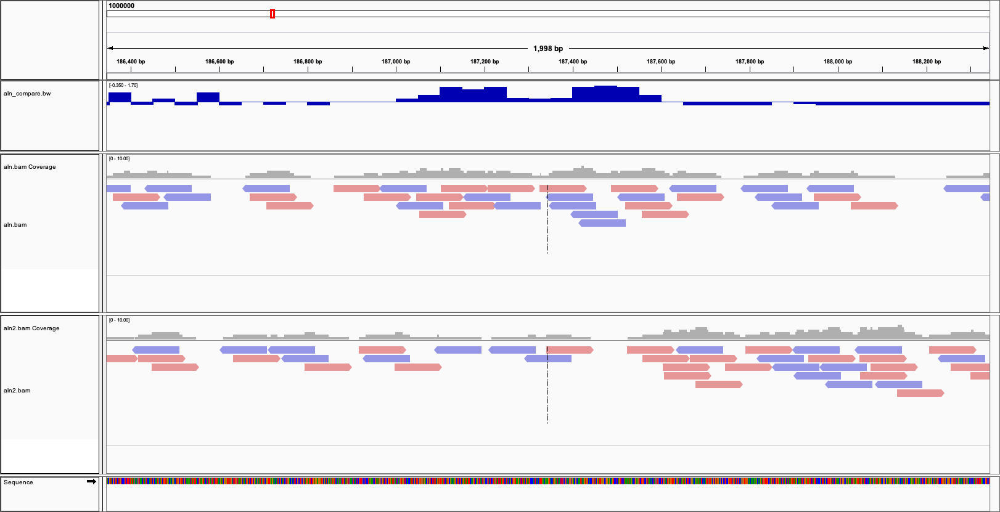

Table of Contents
=================

   * [Table of Contents](#table-of-contents)
   * [Introduction](#introduction)
   * [Installing SAMtools](#installing-samtools)
   * [Basic usage](#basic-usage)
   * [Viewing](#viewing)
   * [Converting a SAM file to a BAM file](#converting-a-sam-file-to-a-bam-file)
   * [Converting a BAM file to a CRAM file](#converting-a-bam-file-to-a-cram-file)
   * [Sorting a BAM file](#sorting-a-bam-file)
   * [Converting SAM directly to a sorted BAM file](#converting-sam-directly-to-a-sorted-bam-file)
   * [Creating a BAM index file](#creating-a-bam-index-file)
   * [Converting a BAM file to a SAM file](#converting-a-bam-file-to-a-sam-file)
   * [Filtering out unmapped reads in BAM files](#filtering-out-unmapped-reads-in-bam-files)
   * [Extracting SAM entries mapping to a specific loci](#extracting-sam-entries-mapping-to-a-specific-loci)
   * [Extracting only the first read from paired end BAM files](#extracting-only-the-first-read-from-paired-end-bam-files)
   * [Stats](#stats)
   * [Interpreting the BAM flags](#interpreting-the-bam-flags)
   * [samtools calmd/fillmd](#samtools-calmdfillmd)
   * [Creating fastq files from a BAM file](#creating-fastq-files-from-a-bam-file)
   * [Random subsampling of BAM file](#random-subsampling-of-bam-file)
   * [Fastest way to count number of reads](#fastest-way-to-count-number-of-reads)
   * [Obtaining genomic sequence](#obtaining-genomic-sequence)
   * [Comparing BAM files](#comparing-bam-files)

Created by [gh-md-toc](https://github.com/ekalinin/github-markdown-toc)

# Introduction

One of my most popular pages on my website is my [SAMtools page](http://davetang.org/wiki/tiki-index.php?page=SAMTools), which I created back in 2011. Unfortunately I can no longer edit that page for technical reasons, so I have migrated the information here. My examples do not include the `-@` argument, which allows the extremely useful feature of multi-threading. This is a very useful feature given that BAM files can get rather huge these days. For the latest information, please refer to the [release notes](https://github.com/samtools/samtools/releases).

I have created an example SAM file to demonstrate the commands. The steps to create `aln.sam` are inside the `run.sh` script. The reads in the SAM file are created from a randomly generated reference sequence; typing `make` will run all the steps used to create the file.

```bash
git clone https://github.com/davetang/learning_bam_file.git
cd learning_bam_file/
make
```

SAMtools provides various tools for manipulating alignments in the SAM/BAM format. The SAM (Sequence Alignment/Map) format (BAM is just the binary form of SAM) is currently the _de facto_ standard for storing large nucleotide sequence alignments. If you are dealing with high-throughput sequencing data, at some point you will probably have to deal with SAM/BAM files, so familiarise yourself with them! All of the examples below, use the `aln.sam` example SAM file that I created.

# Installing SAMtools

Just copy and paste the code below.

```bash
wget https://github.com/samtools/htslib/releases/download/1.7/htslib-1.7.tar.bz2
tar -xjf htslib-1.7.tar.bz2
cd htslib-1.7
make
make prefix=. install
cd ..

wget https://github.com/samtools/samtools/releases/download/1.7/samtools-1.7.tar.bz2
tar -xjf samtools-1.7.tar.bz2
cd samtools-1.7
make
make prefix=. install
cd ..
```

# Basic usage

If you run SAMtools on the terminal without any parameters, all the available utilities are listed:

```bash
samtools

Program: samtools (Tools for alignments in the SAM format)
Version: 1.7 (using htslib 1.7)

Usage:   samtools <command> [options]

Commands:
  -- Indexing
     dict           create a sequence dictionary file
     faidx          index/extract FASTA
     index          index alignment

  -- Editing
     calmd          recalculate MD/NM tags and '=' bases
     fixmate        fix mate information
     reheader       replace BAM header
     targetcut      cut fosmid regions (for fosmid pool only)
     addreplacerg   adds or replaces RG tags
     markdup        mark duplicates

  -- File operations
     collate        shuffle and group alignments by name
     cat            concatenate BAMs
     merge          merge sorted alignments
     mpileup        multi-way pileup
     sort           sort alignment file
     split          splits a file by read group
     quickcheck     quickly check if SAM/BAM/CRAM file appears intact
     fastq          converts a BAM to a FASTQ
     fasta          converts a BAM to a FASTA

  -- Statistics
     bedcov         read depth per BED region
     depth          compute the depth
     flagstat       simple stats
     idxstats       BAM index stats
     phase          phase heterozygotes
     stats          generate stats (former bamcheck)

  -- Viewing
     flags          explain BAM flags
     tview          text alignment viewer
     view           SAM<->BAM<->CRAM conversion
     depad          convert padded BAM to unpadded BAM

```

# Viewing

Use [bioSyntax](https://github.com/bioSyntax/bioSyntax) to prettify your output.

```bash
samtools view aln.bam | sam-less
```


# Converting a SAM file to a BAM file

A BAM file is just a SAM file but stored in binary; you should always convert your SAM files into BAM to save storage space and BAM files are faster to manipulate.

To get started, view the first couple of lines of your SAM file by typing on the terminal:

```bash
head aln.sam 
@SQ     SN:1000000      LN:1000000
@PG     ID:bwa  PN:bwa  VN:0.7.13-r1126 CL:bwa/bwa mem sequence/ref.fa sequence/l100_n10000_d300_31_1.fq sequence/l100_n10000_d300_31_2.fq
1:165617        99      1000000 165617  60      100M    =       165917  400     TGCAGTGGTATCGGATCAGCCTAGATGCCATAGCTGAGCGCCAAATTTCCGGATTTTCCCCGTGTAGTCAATGGAGCTGTTACTTTAAGCCGTGAATGTG    JJJJJJJJJJJJJJJJJJJJJJJJJJJJJJJJJJJJJJJJJJJJJJJJJJJJJJJJJJJJJJJJJJJJJJJJJJJJJJJJJJJJJJJJJJJJJJJJJJJJ    NM:i:0  MD:Z:100        AS:i:100        XS:i:0
1:165617        147     1000000 165917  60      100M    =       165617  -400    AATTCGATATGCCGGTCATCGTGTGTCTATGATACTCCTTAGGCATCCCTTTAACTACGATACTTTAAGAGGTGCGAAAAGTATTCTATACGGCAGCGTA    JJJJJJJJJJJJJJJJJJJJJJJJJJJJJJJJJJJJJJJJJJJJJJJJJJJJJJJJJJJJJJJJJJJJJJJJJJJJJJJJJJJJJJJJJJJJJJJJJJJJ    NM:i:0  MD:Z:100        AS:i:100        XS:i:0
2:591911        99      1000000 591911  60      100M    =       592211  400     GATCAAGCTGGGCATGGGTTCGGTGACGCGTAAAAAAATTTTTTTCTGAGGACCACTGAGAAGATGGTTACGTCTAGGATCTAAGACCTAGTGTCAACTC    JJJJJJJJJJJJJJJJJJJJJJJJJJJJJJJJJJJJJJJJJJJJJJJJJJJJJJJJJJJJJJJJJJJJJJJJJJJJJJJJJJJJJJJJJJJJJJJJJJJJ    NM:i:0  MD:Z:100        AS:i:100        XS:i:0
2:591911        147     1000000 592211  60      100M    =       591911  -400    GCATGACACTGGATAGTGCGATTAGATAGCGGCTCGGGAGTACGTCACTGAAAGTCCAGTGCGAGAGCCAACCCGGAAACTCTACATGCGCATGTAGAAC    JJJJJJJJJJJJJJJJJJJJJJJJJJJJJJJJJJJJJJJJJJJJJJJJJJJJJJJJJJJJJJJJJJJJJJJJJJJJJJJJJJJJJJJJJJJJJJJJJJJJ    NM:i:0  MD:Z:100        AS:i:100        XS:i:0
3:987691        99      1000000 987691  60      100M    =       987991  400     CTCGGGACTATCTGTCAAACACTAGGGCTTGGCATAACATCTCTGAATAATAGCCAACGCGCGAGGTGTACGGGAAAAAGGAGGACCACCGCGTTATCAC    JJJJJJJJJJJJJJJJJJJJJJJJJJJJJJJJJJJJJJJJJJJJJJJJJJJJJJJJJJJJJJJJJJJJJJJJJJJJJJJJJJJJJJJJJJJJJJJJJJJJ    NM:i:0  MD:Z:100        AS:i:100        XS:i:0
3:987691        147     1000000 987991  60      100M    =       987691  -400    ACCGACTCGCAATTATCTCGTATCCGGGAAACTGTATAGCCGGGGGAAACTCCGATACGGACCGGCATTGGTACCAAGCGTCGAGTAGATTACCACCGAC    JJJJJJJJJJJJJJJJJJJJJJJJJJJJJJJJJJJJJJJJJJJJJJJJJJJJJJJJJJJJJJJJJJJJJJJJJJJJJJJJJJJJJJJJJJJJJJJJJJJJ    NM:i:0  MD:Z:100        AS:i:100        XS:i:0
4:301460        99      1000000 301460  60      100M    =       301760  400     GGACGTATACCTACTCGCCCAATTCGATCAGTGGTATCTAGTTAAGAAATAGTCTTCCTCAATTTGACTCGCCTCAACGGTTGTCTATCTGAGCTGGAAT    JJJJJJJJJJJJJJJJJJJJJJJJJJJJJJJJJJJJJJJJJJJJJJJJJJJJJJJJJJJJJJJJJJJJJJJJJJJJJJJJJJJJJJJJJJJJJJJJJJJJ    NM:i:0  MD:Z:100        AS:i:100        XS:i:0
4:301460        147     1000000 301760  60      100M    =       301460  -400    GTGTAGACAGGGCCATACTACTAACATCTCACAGATTAGGTTCATGTCCTCTCTAGCTCGCCAGCGCGGCTACATTTGGACTTGATACCGTTACAACGGT    JJJJJJJJJJJJJJJJJJJJJJJJJJJJJJJJJJJJJJJJJJJJJJJJJJJJJJJJJJJJJJJJJJJJJJJJJJJJJJJJJJJJJJJJJJJJJJJJJJJJ    NM:i:0  MD:Z:100        AS:i:100        XS:i:0
```

The lines starting with the "@" sign contains the header information. The @SQ tag is the reference sequence dictionary; SN refers to the reference sequence name and LN refers to the reference sequence length. If you don't see lines starting with the "@" sign, the header information is most likely missing. If the header is absent from the SAM file use the command below, where ref.fa is the reference fasta file used to map the reads:

```bash
samtools view -bT sequence/ref.fa aln.sam > aln.bam
```

If the header information is available:

```bash
samtools view -bS aln.sam > aln.bam

# in the newer version of SAMtools the input format is autodetected
# hence we don't need the -S parameter any more
samtools view -b aln.sam > aln.bam
```

# Converting a BAM file to a CRAM file

The CRAM format saves you even more disk space; disk usage of SAM = 5.5M, unordered BAM = 978K, ordered BAM = 746K, and CRAM = 91K

```bash
samtools view -T sequence/ref.fa -C -o aln.cram aln.bam

ls -hl aln.sam
-rw-r--r-- 1 dtang dtang 5.5M Feb  9 16:55 aln.sam

# unsorted BAM file
ls -hl aln.bam
-rw-r--r-- 1 dtang dtang 978K Feb 10 16:49 aln.bam

# sorted BAM file
ls -hl aln.bam
-rw-r--r-- 1 dtang dtang 746K Feb 10 16:50 aln.bam

# CRAM from sorted BAM file
ls -hl aln.cram 
-rw-r--r-- 1 dtang dtang 91K Feb 10 16:52 aln.cram
```

I have an [old blog post](https://davetang.org/muse/2014/09/26/bam-to-cram/) on the CRAM format.

# Sorting a BAM file

Always sort your BAM files; many downstream programs only take sorted BAM files.

```bash
samtools sort aln.bam -o aln.bam
```

# Converting SAM directly to a sorted BAM file

Like many Unix tools, SAMtools is able to read directly from a stream i.e. stdout.

```bash
samtools view -bS aln.sam | samtools sort - -o aln.bam
```

In SAMtools version 1.3 or newer, you can sort a SAM file directly.

```bash
samtools sort -o aln.bam aln.sam
```

In addition, you should use use additional threads, if they are available, to speed up sorting.

```bash
samtools sort -@ 8 -o aln.bam aln.sam
```

# Creating a BAM index file

A BAM index file is usually needed when visualising a BAM file.

```bash
samtools index aln.bam
```

# Converting a BAM file to a SAM file

Note: remember to use -h to ensure the converted SAM file contains the header information. Generally, I recommend storing only sorted BAM files as they use much less disk space and are faster to process.

```bash
samtools view -h aln.bam > aln2.sam
```

# Filtering out unmapped reads in BAM files

```bash
samtools view -h -F 4 aln.bam > aln_only_mapped.sam

# output back to BAM
samtools view -h -F 4 -b aln.bam > aln_only_mapped.bam

# in the newer version of SAMtools there is the flags subcommand
# which will tell you what the flags are
samtools flags 4
0x4     4       UNMAP
```

# Extracting SAM entries mapping to a specific loci

If we want all reads mapping within a specific genomic region, we can use `samtools view` and the `ref:start-end` syntax. The name of the reference sequence in my example SAM file is 1000000. You can use just the `ref` to extract an entire reference sequence such as a chromosome (example not shown here).

```bash
# index the bam file first
samtools index aln.bam

# reads mapping in the region 1000 to 1300
samtools view aln.bam 1000000:1000-1300
6144:733        147     1000000 1033    60      100M    =       733     -400    CCCTCCGGGGAGGGGATCTATTAGGAAAGATTCGAGTCGGTACGTTGTATGGAACGGTTAGCACCGCCATATATCAGATTCAAAATTATCTAGGGTTTCA    JJJJJJJJJJJJJJJJJJJJJJJJJJJJJJJJJJJJJJJJJJJJJJJJJJJJJJJJJJJJJJJJJJJJJJJJJJJJJJJJJJJJJJJJJJJJJJJJJJJJ    NM:i:0  MD:Z:100        AS:i:100        XS:i:0
7897:1206       99      1000000 1206    60      100M    =       1506    400     TTGCCGTGTACTGGTTGAGCCATACGCAAAATTGGGATCACATTTGTATTGACGCAGGAAAACTGATGCCCGTATCTCCAGAGGTACCAGAGCGACCTGG    JJJJJJJJJJJJJJJJJJJJJJJJJJJJJJJJJJJJJJJJJJJJJJJJJJJJJJJJJJJJJJJJJJJJJJJJJJJJJJJJJJJJJJJJJJJJJJJJJJJJ    NM:i:0  MD:Z:100        AS:i:100        XS:i:0
9588:1278       99      1000000 1278    60      100M    =       1578    400     TATCTCCAGAGGTACCAGAGCGACCTGGACTTCAGCCAGGGAGATAGAGTATCACACTGAAGGACGGTAGCCGATAGATGAGCTGGACCTTGGATCTACT    JJJJJJJJJJJJJJJJJJJJJJJJJJJJJJJJJJJJJJJJJJJJJJJJJJJJJJJJJJJJJJJJJJJJJJJJJJJJJJJJJJJJJJJJJJJJJJJJJJJJ    NM:i:0  MD:Z:100        AS:i:100        XS:i:0

# all reads mapping on 1000000 between 1000 to 1300 saved to another BAM file
samtools view -b aln.bam 1000000:1000-1300 > aln_1000_1300.bam
```

You can also use a BED file, with several entries, to extract reads of interest.

```bash
cat my.bed 
1000000 1000    1300
1000000 2000    2300

samtools view -L my.bed aln.bam
6144:733        147     1000000 1033    60      100M    =       733     -400    CCCTCCGGGGAGGGGATCTATTAGGAAAGATTCGAGTCGGTACGTTGTATGGAACGGTTAGCACCGCCATATATCAGATTCAAAATTATCTAGGGTTTCA    JJJJJJJJJJJJJJJJJJJJJJJJJJJJJJJJJJJJJJJJJJJJJJJJJJJJJJJJJJJJJJJJJJJJJJJJJJJJJJJJJJJJJJJJJJJJJJJJJJJJ  NM:i:0  MD:Z:100        AS:i:100        XS:i:0
7897:1206       99      1000000 1206    60      100M    =       1506    400     TTGCCGTGTACTGGTTGAGCCATACGCAAAATTGGGATCACATTTGTATTGACGCAGGAAAACTGATGCCCGTATCTCCAGAGGTACCAGAGCGACCTGG    JJJJJJJJJJJJJJJJJJJJJJJJJJJJJJJJJJJJJJJJJJJJJJJJJJJJJJJJJJJJJJJJJJJJJJJJJJJJJJJJJJJJJJJJJJJJJJJJJJJJ  NM:i:0  MD:Z:100        AS:i:100        XS:i:0
9588:1278       99      1000000 1278    60      100M    =       1578    400     TATCTCCAGAGGTACCAGAGCGACCTGGACTTCAGCCAGGGAGATAGAGTATCACACTGAAGGACGGTAGCCGATAGATGAGCTGGACCTTGGATCTACT    JJJJJJJJJJJJJJJJJJJJJJJJJJJJJJJJJJJJJJJJJJJJJJJJJJJJJJJJJJJJJJJJJJJJJJJJJJJJJJJJJJJJJJJJJJJJJJJJJJJJ  NM:i:0  MD:Z:100        AS:i:100        XS:i:0
10:1630 147     1000000 1930    60      100M    =       1630    -400    CCACCCACTACAGTAAATGAGAGAAAACGGATTAAGGTTCTAACCCTTAGCGATGACCGTTCTCACGGGTGTCTAGATACCGAGTAGAACCAACCAGCAC    JJJJJJJJJJJJJJJJJJJJJJJJJJJJJJJJJJJJJJJJJJJJJJJJJJJJJJJJJJJJJJJJJJJJJJJJJJJJJJJJJJJJJJJJJJJJJJJJJJJJ  NM:i:0  MD:Z:100        AS:i:100        XS:i:0
9137:1657       147     1000000 1957    60      100M    =       1657    -400    CGGATTAAGGTTCTAACCCTTAGCGATGACCGTTCTCACGGGTGTCTAGATACCGAGTAGAACCAACCAGCACCCAGCATTAAACCACAGAAGCACCGTT    JJJJJJJJJJJJJJJJJJJJJJJJJJJJJJJJJJJJJJJJJJJJJJJJJJJJJJJJJJJJJJJJJJJJJJJJJJJJJJJJJJJJJJJJJJJJJJJJJJJJ  NM:i:0  MD:Z:100        AS:i:100        XS:i:0
5893:1667       147     1000000 1967    60      100M    =       1667    -400    TTCTAACCCTTAGCGATGACCGTTCTCACGGGTGTCTAGATACCGAGTAGAACCAACCAGCACCCAGCATTAAACCACAGAAGCACCGTTGGTTTCTTTA    JJJJJJJJJJJJJJJJJJJJJJJJJJJJJJJJJJJJJJJJJJJJJJJJJJJJJJJJJJJJJJJJJJJJJJJJJJJJJJJJJJJJJJJJJJJJJJJJJJJJ  NM:i:0  MD:Z:100        AS:i:100        XS:i:0
3617:1997       99      1000000 1997    60      100M    =       2297    400     GGTGTCTAGATACCGAGTAGAACCAACCAGCACCCAGCATTAAACCACAGAAGCACCGTTGGTTTCTTTAATAGCTTCAACGCCGGCCATATCAATAAAA    JJJJJJJJJJJJJJJJJJJJJJJJJJJJJJJJJJJJJJJJJJJJJJJJJJJJJJJJJJJJJJJJJJJJJJJJJJJJJJJJJJJJJJJJJJJJJJJJJJJJ  NM:i:0  MD:Z:100        AS:i:100        XS:i:0
5736:1773       147     1000000 2073    60      100M    =       1773    -400    TCAACGCCGGCCATATCAATAAAAGGCTGTCGCCACATCCGTGGGTGCAAACTGAGCAGCCATGAACCTGGAAACGTTGTAGCCATGAAGATAATGCATA    JJJJJJJJJJJJJJJJJJJJJJJJJJJJJJJJJJJJJJJJJJJJJJJJJJJJJJJJJJJJJJJJJJJJJJJJJJJJJJJJJJJJJJJJJJJJJJJJJJJJ  NM:i:0  MD:Z:100        AS:i:100        XS:i:0
3123:2230       99      1000000 2230    60      100M    =       2530    400     CGGCACGTGCTGTCAGTATATAGTGTCGCTCATCAGGGAGGTACACCACGCGGTGGAGCATCCACGCTTTTCCCCATCTTCTATTACCTCGGCGGGGAAA    JJJJJJJJJJJJJJJJJJJJJJJJJJJJJJJJJJJJJJJJJJJJJJJJJJJJJJJJJJJJJJJJJJJJJJJJJJJJJJJJJJJJJJJJJJJJJJJJJJJJ  NM:i:0  MD:Z:100        AS:i:100        XS:i:0
4758:2263       99      1000000 2263    60      100M    =       2563    400     CAGGGAGGTACACCACGCGGTGGAGCATCCACGCTTTTCCCCATCTTCTATTACCTCGGCGGGGAAACAGGTAGATATGGGGGTTGGCTTGTGCAAGATA    JJJJJJJJJJJJJJJJJJJJJJJJJJJJJJJJJJJJJJJJJJJJJJJJJJJJJJJJJJJJJJJJJJJJJJJJJJJJJJJJJJJJJJJJJJJJJJJJJJJJ  NM:i:0  MD:Z:100        AS:i:100        XS:i:0
3617:1997       147     1000000 2297    60      100M    =       1997    -400    TTTTCCCCATCTTCTATTACCTCGGCGGGGAAACAGGTAGATATGGGGGTTGGCTTGTGCAAGATACAATTCGATAGTTGCGGGGGCTTAGATCGGCGTG    JJJJJJJJJJJJJJJJJJJJJJJJJJJJJJJJJJJJJJJJJJJJJJJJJJJJJJJJJJJJJJJJJJJJJJJJJJJJJJJJJJJJJJJJJJJJJJJJJJJJ  NM:i:0  MD:Z:100        AS:i:100        XS:i:0
```

# Extracting only the first read from paired end BAM files

Sometimes you only want the first pair of a mate.

```bash
samtools view -h -f 0x0040 aln.bam > aln_first_pair.sam
```

0x0040 is hexadecimal for 64 (i.e. 16 * 4), which is binary for 1000000, corresponding to the read in the first read pair.

# Stats

For simple statistics use `samtools flagstat`.

```bash
samtools flagstat aln.bam
20000 + 0 in total (QC-passed reads + QC-failed reads)
0 + 0 secondary
0 + 0 supplementary
0 + 0 duplicates
20000 + 0 mapped (100.00% : N/A)
20000 + 0 paired in sequencing
10000 + 0 read1
10000 + 0 read2
20000 + 0 properly paired (100.00% : N/A)
20000 + 0 with itself and mate mapped
0 + 0 singletons (0.00% : N/A)
0 + 0 with mate mapped to a different chr
0 + 0 with mate mapped to a different chr (mapQ>=5)
```

For more stats, use `samtools stats`.

```bash
samtools stats aln.bam | grep ^SN
SN      raw total sequences:    20000
SN      filtered sequences:     0
SN      sequences:      20000
SN      is sorted:      1
SN      1st fragments:  10000
SN      last fragments: 10000
SN      reads mapped:   20000
SN      reads mapped and paired:        20000   # paired-end technology bit set + both mates mapped
SN      reads unmapped: 0
SN      reads properly paired:  20000   # proper-pair bit set
SN      reads paired:   20000   # paired-end technology bit set
SN      reads duplicated:       0       # PCR or optical duplicate bit set
SN      reads MQ0:      0       # mapped and MQ=0
SN      reads QC failed:        0
SN      non-primary alignments: 0
SN      total length:   2000000 # ignores clipping
SN      bases mapped:   2000000 # ignores clipping
SN      bases mapped (cigar):   2000000 # more accurate
SN      bases trimmed:  0
SN      bases duplicated:       0
SN      mismatches:     0       # from NM fields
SN      error rate:     0.000000e+00    # mismatches / bases mapped (cigar)
SN      average length: 100
SN      maximum length: 100
SN      average quality:        41.0
SN      insert size average:    400.0
SN      insert size standard deviation: 0.0
SN      inward oriented pairs:  10000
SN      outward oriented pairs: 0
SN      pairs with other orientation:   0
SN      pairs on different chromosomes: 0
```

In addition, you can create plots from the `samtools stats` output using `plot-bamstats`; you need to have `gnuplot` installed though. `plot-bamstats` is located in the `misc` directory where you downloaded `samtools`.

```bash
samtools stats aln.bam > aln.stat

~/src/samtools-1.6/misc/plot-bamstats -p out/ aln.stat

ls -1 out
acgt-cycles.gp
acgt-cycles.png
coverage.gp
coverage.png
gc-content.gp
gc-content.png
gc-depth.gp
gc-depth.png
index.html
insert-size.gp
insert-size.png
quals-hm.gp
quals-hm.png
quals.gp
quals.png
quals2.gp
quals2.png
quals3.gp
quals3.png
```

# Interpreting the BAM flags

The second column in a SAM/BAM file is the flag column. They may seem confusing at first but the encoding allows details about a read to be stored by just using a few digits. The trick is to convert the numerical digit into binary, and then use the table to interpret the binary numbers, where 1 = true and 0 = false. I wrote a blog post on BAM flags: <http://davetang.org/muse/2014/03/06/understanding-bam-flags/>, which also includes a Perl script for interpreting BAM flags. There is also the `flags` subcommand.

```bash
samtools flags

About: Convert between textual and numeric flag representation
Usage: samtools flags INT|STR[,...]

Flags:
        0x1     PAIRED        .. paired-end (or multiple-segment) sequencing technology
        0x2     PROPER_PAIR   .. each segment properly aligned according to the aligner
        0x4     UNMAP         .. segment unmapped
        0x8     MUNMAP        .. next segment in the template unmapped
        0x10    REVERSE       .. SEQ is reverse complemented
        0x20    MREVERSE      .. SEQ of the next segment in the template is reversed
        0x40    READ1         .. the first segment in the template
        0x80    READ2         .. the last segment in the template
        0x100   SECONDARY     .. secondary alignment
        0x200   QCFAIL        .. not passing quality controls
        0x400   DUP           .. PCR or optical duplicate
        0x800   SUPPLEMENTARY .. supplementary alignment

samtools flags 16
0x10    16      REVERSE
```

# samtools calmd/fillmd

The calmd or fillmd tool is useful for visualising mismatches and insertions in an alignment of a read to a reference genome. For example:

```bash
#the -e changes identical bases between the read and reference into a bunch of =
samtools view -b aln.bam | samtools fillmd -e - sequence/ref.fa | head
@HD     VN:1.3  SO:coordinate
@SQ     SN:1000000      LN:1000000
@PG     ID:bwa  PN:bwa  VN:0.7.13-r1126 CL:bwa/bwa mem sequence/ref.fa sequence/l100_n10000_d300_31_1.fq sequence/l100_n10000_d300_31_2.fq
6125:151        99      1000000 151     60      100M    =       451     400     ====================================================================================================    JJJJJJJJJJJJJJJJJJJJJJJJJJJJJJJJJJJJJJJJJJJJJJJJJJJJJJJJJJJJJJJJJJJJJJJJJJJJJJJJJJJJJJJJJJJJJJJJJJJJ    NM:i:0  MD:Z:100        AS:i:100        XS:i:0
9336:174        99      1000000 174     60      100M    =       474     400     ====================================================================================================    JJJJJJJJJJJJJJJJJJJJJJJJJJJJJJJJJJJJJJJJJJJJJJJJJJJJJJJJJJJJJJJJJJJJJJJJJJJJJJJJJJJJJJJJJJJJJJJJJJJJ    NM:i:0  MD:Z:100        AS:i:100        XS:i:0
1355:335        99      1000000 335     60      100M    =       635     400     ====================================================================================================    JJJJJJJJJJJJJJJJJJJJJJJJJJJJJJJJJJJJJJJJJJJJJJJJJJJJJJJJJJJJJJJJJJJJJJJJJJJJJJJJJJJJJJJJJJJJJJJJJJJJ    NM:i:0  MD:Z:100        AS:i:100        XS:i:0
7456:415        99      1000000 415     60      100M    =       715     400     ====================================================================================================    JJJJJJJJJJJJJJJJJJJJJJJJJJJJJJJJJJJJJJJJJJJJJJJJJJJJJJJJJJJJJJJJJJJJJJJJJJJJJJJJJJJJJJJJJJJJJJJJJJJJ    NM:i:0  MD:Z:100        AS:i:100        XS:i:0
6125:151        147     1000000 451     60      100M    =       151     -400    ====================================================================================================    JJJJJJJJJJJJJJJJJJJJJJJJJJJJJJJJJJJJJJJJJJJJJJJJJJJJJJJJJJJJJJJJJJJJJJJJJJJJJJJJJJJJJJJJJJJJJJJJJJJJ    NM:i:0  MD:Z:100        AS:i:100        XS:i:0
9336:174        147     1000000 474     60      100M    =       174     -400    ====================================================================================================    JJJJJJJJJJJJJJJJJJJJJJJJJJJJJJJJJJJJJJJJJJJJJJJJJJJJJJJJJJJJJJJJJJJJJJJJJJJJJJJJJJJJJJJJJJJJJJJJJJJJ    NM:i:0  MD:Z:100        AS:i:100        XS:i:0
1355:335        147     1000000 635     60      100M    =       335     -400    ====================================================================================================    JJJJJJJJJJJJJJJJJJJJJJJJJJJJJJJJJJJJJJJJJJJJJJJJJJJJJJJJJJJJJJJJJJJJJJJJJJJJJJJJJJJJJJJJJJJJJJJJJJJJ    NM:i:0  MD:Z:100        AS:i:100        XS:i:0
```

The reads I have generated have no mismatches, so they are all displayed as equal signs.

# Creating fastq files from a BAM file

Use BEDTools.

```bash
bedtools bamtofastq -i aln.bam -fq aln.fq
```

There is the `fastq` subcommand in the newer version of SAMtools.

```bash
samtools fastq -1 aln_1.fq -2 aln_2.fq aln.bam
```

# Random subsampling of BAM file

The SAMtools view -s parameter allows you to randomly sample lines of a BAM file

```bash
samtools view -s 0.5 -b aln.bam > aln_random.bam
```

Note that this will subsample half of the reads that mapped.

# Fastest way to count number of reads

Use `samtools idxstats` to print stats on a BAM file; this requires an index file which is created by running `samtools index`. The reference sequence name of the example SAM file in this repository is (confusingly) called 1000000. More standard reference names are 'chr1', 'chr2', etc.

```bash
# convert to BAM and sort
samtools view -bS aln.sam | samtools sort - > aln.bam

# index
samtools index aln.bam

# output of idxstats is:
# ref name, sequence length of ref, no. mapped reads, and no. unmapped reads
samtools idxstats aln.bam
1000000 1000000 20000   0
*       0       0       0

# number of reads = mapped + unmapped
samtools idxstats aln.bam | awk '{s+=$3+$4} END {print s}'
20000

# number of mapped reads = 3rd column
samtools idxstats aln.bam | awk '{s+=$3} END {print s}'
20000
```

# Obtaining genomic sequence

```bash
# index fasta file
samtools faidx sequence/ref.fa

# obtain sequence
samtools faidx sequence/ref.fa 1000000:10-11
>1000000:10-11
AG

# note the 1-based start
samtools faidx sequence/ref.fa 1000000:0-2
>1000000:0-2
AG

samtools faidx sequence/ref.fa 1000000:1-2
>1000000:1-2
AG
```

# Comparing BAM files

Install [deepTools](https://deeptools.readthedocs.io/en/develop/) and use [bamCompare](https://deeptools.readthedocs.io/en/develop/content/tools/bamCompare.html). The bigWig output file shows the ratio of reads between `b1` and `b2` in 50 bp (default) windows.

```bash
# create BAM files
samtools view -bS aln.sam | samtools sort > aln.bam
samtools view -bS aln2.sam | samtools sort > aln2.bam

# index
samtools index aln.bam
samtools index aln2.bam

bamCompare -b1 aln.bam -b2 aln2.bam -of bigwig -o aln_compare.bw
```



# Coverage

We can use `samtools depth` to tally the number of reads covering a region; the three columns are the reference, position, and read coverage. In the example below, there are two reads covering positions 200 - 205. The `samtools mpileup` command can provide more information, including:

1. Sequence name
2. 1-based coordinate
3. Reference base
4. Number of reads covering this position
5. Read bases
6. Base qualities
7. Alignment mapping qualities

See https://davetang.org/muse/2015/08/26/samtools-mpileup/ for more information.

```bash
# create sorted BAM file
samtools view -b aln.sam | samtools sort - -o aln.bam

samtools depth aln.bam | sed -n '50,55p'
1000000 200     2
1000000 201     2
1000000 202     2
1000000 203     2
1000000 204     2
1000000 205     2

samtools mpileup -f sequence/ref.fa -s aln.bam | sed -n '50,55p'
[mpileup] 1 samples in 1 input files
<mpileup> Set max per-file depth to 8000
1000000 200     A       2       ..      JJ      ]]
1000000 201     T       2       ..      JJ      ]]
1000000 202     T       2       ..      JJ      ]]
1000000 203     C       2       ..      JJ      ]]
1000000 204     A       2       ..      JJ      ]]
1000000 205     G       2       ..      JJ      ]]
```

